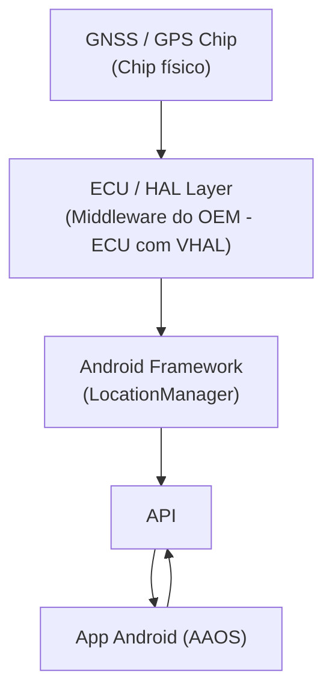
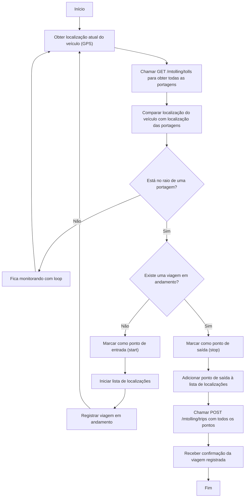

# Diferenças entre Location API e LocationManager no Android (incluindo Android Automotive OS)

## O que é a Location API?

A **Location API** (ou **Fused Location Provider API**) é uma API de alto nível oferecida pelo **Google Play Services**, que fornece dados de localização de forma precisa, eficiente e com baixo consumo de bateria.

### Principais características:
- Utiliza **fusão de sensores**: GPS, Wi-Fi, redes móveis e sensores internos.
- Interface moderna via `FusedLocationProviderClient`.
- Ajusta a precisão e frequência de atualização automaticamente.
- Requer GMS (Google Mobile Services).

---

## O que é o LocationManager?

O `LocationManager` é a API **nativa do Android (AOSP)** que fornece acesso direto aos **provedores de localização individuais** como GPS ou rede.

### Menor dependência de software proprietário

- FusedLocationProviderClient é parte dos Google Play Services, que é um serviço proprietário.

- LocationManager faz parte do Android SDK puro, funcionando em qualquer ROM (incluindo customizadas ou versões sem Google).

- Segurança: menor superfície de ataque externa e mais transparência no acesso à localização (sem middleman da Google).

### Maior controle sobre fontes de localização

Com o LocationManager, você pode decidir explicitamente se deseja usar:

- GPS_PROVIDER (alta precisão)

- NETWORK_PROVIDER (menos preciso, mais rápido)

- PASSIVE_PROVIDER (só recebe atualizações)

Com o FusedLocationProviderClient, o sistema pode combinar dados de múltiplas fontes (GPS, Wi-Fi, Bluetooth, sensores, etc.) de forma opaca.

Segurança: controle direto sobre o que exatamente está sendo usado para obter a localização.

### Evita coleta invisível de dados por terceiros

- O Fused Location pode coletar dados e enviar para a Google (especialmente se permissões e serviços do Google estiverem ativos).

- Usar LocationManager pode reduzir esse risco, porque ele não faz upload ou agregação externa por padrão.

- Privacidade: menor risco de data leakage para terceiros.

### Melhor alinhamento com dispositivos com foco em privacidade

- Dispositivos com Android de código aberto (AOSP), LineageOS sem GApps, /e/ OS, etc., frequentemente não têm o Google Play Services.

- Nesses casos, o LocationManager é a única opção segura e funcional.

Segurança: compatibilidade com ambientes mais restritivos e auditáveis.

### Transparência no uso da localização

- Com o LocationManager, o desenvolvedor define explicitamente qual provedor está sendo usado (GPS, Network, Passive).

- Isso permite que o app deixe claro para o usuário de onde a localização está vindo.

- Controle do usuário: o app pode mostrar ao usuário exatamente o que está ativado e por quê.

### Menor acoplamento com serviços invisíveis

- FusedLocationProviderClient usa uma "caixa preta" do Google Play Services que pode continuar rodando em background e utilizar sensores como Wi-Fi, Bluetooth e atividade física.

- Isso pode fazer o app parecer mais invasivo, mesmo que ele tenha solicitado permissão apenas uma vez.

- Controle do usuário: com o LocationManager, é mais fácil garantir que o app só use a localização quando realmente estiver em uso (foreground).

### Menos permissões implícitas

O FusedLocationProviderClient pode solicitar acesso indireto a permissões como:

- Atividade física

- Bluetooth

- Wi-Fi scanning

Com o LocationManager, o uso da localização se baseia estritamente nas permissões ACCESS_FINE_LOCATION ou ACCESS_COARSE_LOCATION.

Controle do usuário: permissões mais claras e diretas, sem efeitos colaterais ou "acesso lateral".

### Comportamento previsível em diferentes versões do Android

- O LocationManager depende da API do sistema operacional, que é documentada e respeita consistentemente as configurações do usuário.

- Já o FusedLocationProviderClient pode continuar funcionando mesmo com o GPS desligado (usando outras fontes), o que pode confundir o usuário.

Controle do usuário: se o GPS está desligado, a localização simplesmente não funciona — o que é o esperado.

### Principais características:
- **Não depende de GMS**, funciona em qualquer build AOSP.
- Mais baixo nível e flexível.
- Requer que o desenvolvedor escolha manualmente o provedor.
- Pode consumir mais bateria se mal configurado.

---

## Comparativo: Location API vs LocationManager

| Característica                  | Location API (`FusedLocationProviderClient`) | LocationManager                        |
|--------------------------------|----------------------------------------------|----------------------------------------|
| Fonte                          | Google Play Services                         | Android AOSP                           |
| Requer GMS                     | ✅ Sim                                       | ❌ Não                                 |
| Facilidade de uso              | ✅ Alta                                      | ❌ Média (mais manual)                 |
| Fusão automática de sensores   | ✅ Sim                                       | ❌ Não                                 |
| Controle de provedores         | ❌ Não (automático)                          | ✅ Sim (GPS, NETWORK, PASSIVE)         |
| Consumo otimizado de bateria   | ✅ Sim                                       | ❌ Depende do uso                      |
| Suporte em dispositivos sem GMS| ❌ Não                                       | ✅ Sim                                 |

---

## Compatibilidade com Sistemas Android Automotive

| Sistema / OEM                         | Location API (Fused) | LocationManager | Observações |
|--------------------------------------|----------------------|-----------------|-------------|
| Volvo XC40 / C40 Recharge            | ✅ Sim               | ✅ Sim          | AAOS com GMS |
| Polestar 2 / 3                       | ✅ Sim               | ✅ Sim          | AAOS com GMS |
| Renault Mégane E-Tech                | ✅ Sim               | ✅ Sim          | AAOS com GMS |
| Chevrolet Blazer EV                  | ✅ Sim               | ✅ Sim          | AAOS com GMS |
| Honda Accord Touring 2023+          | ✅ Sim               | ✅ Sim          | AAOS com GMS |
| Nissan Ariya                         | ✅ Sim (parcial)     | ✅ Sim          | Variável por região |
| Lucid Air (Lucid UX)                | ❌ Não               | ✅ Sim          | AOSP sem GMS |
| Rivian R1T / R1S                    | ❌ Não               | ✅ Sim          | Android embarcado |
| Volkswagen MIB3 / CARIAD            | ❌ Não               | ✅ Sim          | Stack AOSP própria |
| Stellantis (Uconnect 5 - Fiat, Jeep)| ❌ Não               | ✅ Sim          | Android embarcado |
| BYD / Xpeng / NIO (China)           | ❌ Não               | ✅ Sim          | Android sem Google |

---

# Fluxo

LocationManager faz parte do Android SDK, acessa diretamente os dados fornecidos pelo HAL (Hardware Abstraction Layer) ou ECU, sem depender do Google Play Services.

Ele atua como interface oficial e nativa do Android para receber dados de localização vindos do sistema, como do chip GNSS via VHAL.

O FusedLocationProviderClient, por outro lado, está em D, acima do Framework, como uma API adicional via Google Play Services.

## Acesso aos dados de localização usando LocationManager

### 1. GNSS HAL (GNSS Hardware Abstraction Layer)

O GNSS HAL é a camada de abstração que permite ao Android acessar os dados do chip GNSS (GPS) de forma padronizada. Ele fornece uma interface para o sistema operacional interagir com o hardware de localização.

### 2. LocationProviderService (parte do system server)

O GNSS HAL transmite os dados de localização para um Location Provider Service do Android (GnssLocationProvider ou GnssLocationProviderProxy), que atua como o tradutor entre o HAL e o LocationManager.

### 3. LocationManager (no Android Framework)

O LocationManager interage com os Location Providers internos, como:

- GpsLocationProvider (ou GnssLocationProvider)

- NetworkLocationProvider (se houver)

Ele não se conecta diretamente ao HAL. Em vez disso, ele se conecta ao serviço de sistema que já está recebendo os dados do HAL.

### 4. App Android (com ou sem GMS)

O app consome a localização via LocationManager, sem passar por GMS (Google Mobile Services).

### 5. Comportamento

| Componente       | Responsabilidade                                 |
| ---------------- | ------------------------------------------------ |
| GNSS HAL         | Interface com chip ou ECU                        |
| LocationProvider | Tradução do dado bruto de localização            |
| LocationManager  | API pública para apps acessarem localização      |
| App              | Consome localização (sem saber da origem direta) |

## Conclusão

- Se o dispositivo **possui GMS**, a melhor escolha é usar a **Location API** (`FusedLocationProviderClient`).
- Se o sistema **não possui GMS** (muitos OEMs automotivos), a única opção confiável é usar o `LocationManager`.
- Ambos podem coexistir, e é possível detectar qual está disponível em tempo de execução.
- FusedLocationProviderClient ainda é mais eficiente em consumo de bateria e geralmente fornece localização mais precisa com menos esforço.
- Mas do ponto de vista de segurança e privacidade, especialmente se você busca controle total do dispositivo, LocationManager tem vantagens claras.
- O FusedLocationProviderClient implementa funcionalidades como location batching, geofencing e background location updates de forma otimizada — o que é bom para apps de produção, mas reduz o controle detalhado do usuário final.

- Para apps de privacidade, segurança ou transparência, o LocationManager permite um controle mais refinado e previsível.

