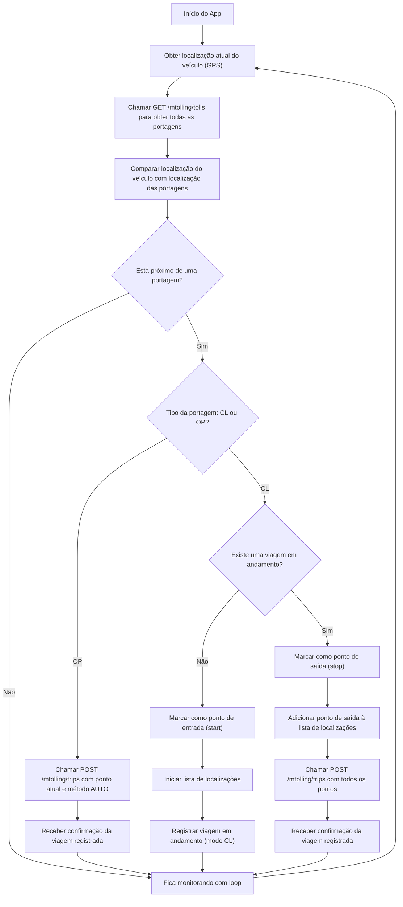

# Trip Management Flow

```mermaid
graph TD

A[Início do App] --> B["Obter localização atual do veículo (GPS)"]
B --> C[Chamar GET /mtolling/tolls para obter todas as portagens]
C --> D[Comparar localização do veículo com localização das portagens]

D --> E{Está próximo de uma portagem?}
E -- Não --> LOOP[Fica monitorando com loop] --> B

E -- Sim --> F{Tipo da portagem: CL ou OP?}

F -- OP --> G1[Chamar POST /mtolling/trips com ponto atual e método AUTO]
G1 --> G2[Receber confirmação da viagem registrada]
G2 --> LOOP

F -- CL --> H{Existe uma viagem em andamento?}

H -- Não --> I["Marcar como ponto de entrada (start)"]
I --> J[Iniciar lista de localizações]
J --> REGCL["Registrar viagem em andamento (modo CL)"]
REGCL --> LOOP

H -- Sim --> L["Marcar como ponto de saída (stop)"]
L --> M[Adicionar ponto de saída à lista de localizações]
M --> N[Chamar POST /mtolling/trips com todos os pontos]
N --> P[Receber confirmação da viagem registrada]
P --> LOOP

```
